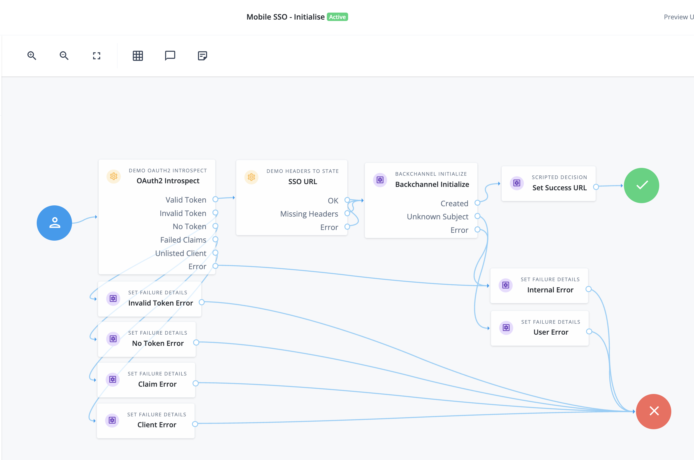
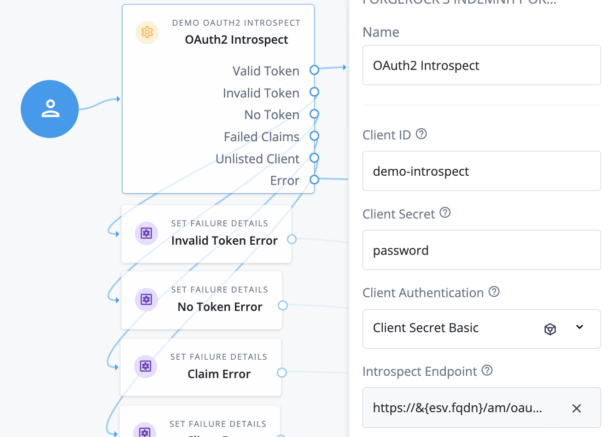
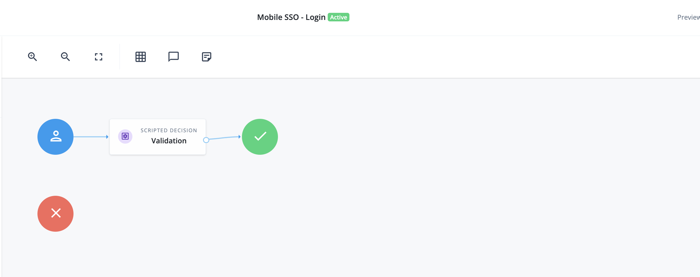
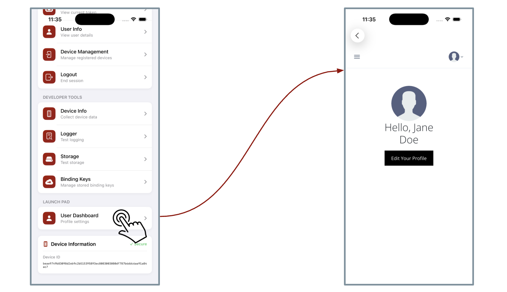

# Mobile to web SSO with PingOne Identity Cloud

## Introduction

This repository contains sample artefacts for demonstrating how to enable single signon between a mobile app and a webview launched from the app, using PingOne Advanced Identity Cloud (or a version of PingAM which supports Backchannel Authentication).

Refer to the [associated blog](https://medium.com/@christian.brindley/wwwhoosh-creating-a-mobile-launchpad-for-your-web-apps-using-ping-advanced-identity-cloud-79a7faa095ed) for more background.

## Repository contents

The repository contains the following directories

- <b>journeys</b>: Two journeys for the initiation of the SSO request, and the follow on backchannel journey:
  - `Mobile SSO - Initialise-journeyExport.json`
  - `Mobile SSO - Login-journeyExport.json`

- <b>custom-nodes</b>: Sample custom nodes included in the initialisation journey:
  - `DEMO Headers to State-node.json`
  - `DEMO OAuth2 Introspect-nodejson`

- <b>ios</b>: Sample customisations to the demonstration iOS app included with the Ping SDK sample apps repo.

## Requirements

To run this demo, you will need

- A [PingOne Advanced Identity Cloud](https://docs.pingidentity.com/pingoneaic/getting-started/overview.html) tenant (or [PingAM](https://docs.pingidentity.com/pingam/latest/index.html) version which supports Backchannel Authentication)
- The [Ping SDK sample app repository](https://github.com/ForgeRock/sdk-sample-apps)
- Xcode

## Platform configuration

Platform configuration involves the following

- Configure an OAuth2 client for token introspection
- Import the two custom nodes from this repo
- Import and configure the two journeys for SSO initialisation and login

### OAuth2 client

First, create an OAuth2 client for use by the OAuth2 introspection node in the initialisation journey.

Choose a client name - e.g. `demo-instrospect` - and grant it permission to introspect tokens from any client, using the ["magic" scope](https://docs.pingidentity.com/pingoneaic/am-oauth2/oauth2-scopes.html#special-oauth2-scopes) `am-introspect-all-tokens`.

### Custom nodes

Next, use the PingOne AIC admin console to [import the two custom nodes](https://docs.pingidentity.com/pingoneaic/journeys/node-designer.html#import-custom-node) into your PingOne AIC tenant.

- DEMO Headers to State-node.json
- DEMO OAuth2 Introspect-node.json

### Journeys

Now use the [PingOne AIC admin console](https://docs.pingidentity.com/pingoneaic/journeys/journeys.html#import-journeys) to import the two journeys from the `journeys` directory of this repository:

- Mobile SSO - Initialise-journeyExport.json
- Mobile SSO - Login-journeyExport.json

Open the `Mobile SSO - Initialise` journey in the admin console:



Configure the first node - `OAuth2 Introspect` - with the following:



- Client ID and secret for the introspect OAuth2 client (you need to use an ESV for the secret once everything is working)
- Client Authentication set to POST or BASIC depending on your client configuration
- Introspect endpoint set to the public URL for the realm instrospect URL - e.g. `https://openam-demo.forgeblocks.com/am/oauth2/realms/root/realms/alpha/introspect` (you need to use an ESV for the FQDN part once everything is working)

The remaining configuration can be left as is. Note that the demo journey assumes that the mobile access token includes a `user_id` claim with the user's UUID as its value. This is stored in the shared state of the backchannel journey so that the correct user is logged in.

Open the `Mobile SSO - Login` journey in the admin console.



Note that this is pretty minimal. The `Validation` node is a placeholder for any logic you want to apply to the backchannel login process, such as IP address correlation, risk checks etc.

## Mobile app integration

### Build the iOS sample journey app

First, get the sample journey app working as supplied in the [Ping SDK sample app repo](https://github.com/ForgeRock/sdk-sample-apps). This is the iOS app under `sdk-sample-apps/iOS/swiftui-journey-module/JourneyModuleSample`.

### Update the app to include an SSO launchpad

Now update the source files with the versions supplied in the `ios` directory of this repo - i.e.

- Replace `JourneyModuleSample/Views/ContentView.swift` with the version in this repo (changes tagged with `// MOBILE-SSO`)

- Add `WebViewScreeen.swift` into `JourneyModuleSample/Views`

- Update `JourneyModuleSample/Info.plist` with the additional lines from the sample in this repo:

```
	<key>enduserDashboardUrl</key>
	<string>https://openam-demo.forgeblocks.com/enduser/?realm=/alpha#/dashboard</string>
	<key>ssoInitiationJourneyUrl</key>
	<string>https://openam-demo.forgeblocks.com/am/json/realms/root/realms/alpha/authenticate?authIndexType=service&amp;authIndexValue=Mobile%20SSO%20-%20Initialise</string>
```

where `openam-demo.forgeblocks.com` is replaced with your PingOne AIC tenant domain name.

### Test

After the updates are applied, you should see an additional section in the app main menu, called "Launch Pad". This section should contain a single menu item called "User Dashboard".

To test, first tap the Journey Flow menu item and log in. Then tap the User Dashboard menu and this should launch the PingOne AIC end user dashboard app.



You can now customise further, adding any other apps you want to use to demonstrate SSO.
